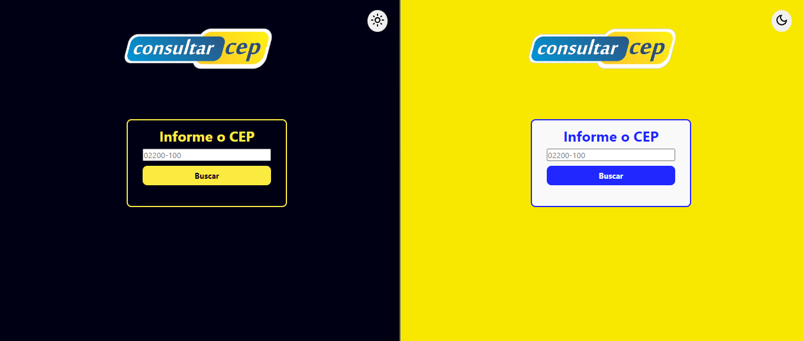

# Site para Consultar CEP

Este é um projeto simples de consulta de CEP que permite aos usuários encontrar informações sobre endereços a partir de um CEP.

## Layout Final do Projeto:

## Vídeo de Apresentação e Link de Acesso ao Projeto

- Você pode acessar o projeto [aqui](https://soft-faloodeh-69b134.netlify.app/).

- Assista a um vídeo de apresentação do projeto no LinkedIn [aqui](https://bit.ly/Site_Consultar_CEP_In).

## Funcionalidades

- Consulta de CEP via formulário.
- Apresentação das informações de rua, bairro, cidade e estado associadas ao CEP.
- Validação do CEP antes de efetuar a consulta.

## Tecnologias Usadas

- HTML5
- CSS3
- JavaScript
- API CEP [Link]("https://viacep.com.br/ws/")

## Instalação

Para começar a usar este projeto, siga os passos abaixo:

1. Clone o repositório para o seu computador local usando o seguinte comando no seu terminal:

- `git clone https://github.com/tiagosfneves/siteConsultarCEP.git`

2. Ou se preferir pode baixar o zip:
- Clique no botão `CODE` no cabeçalho desta página
- Deposi clique em `Download ZIP`

## Pré-requisitos

- Navegador da web com suporte a JavaScript.

## Uso

1. Abra o arquivo `index.html` no seu navegador.
2. Insira o CEP desejado no campo de entrada.
3. Clique no botão "Pesquisar" ou pressione a tecla "Enter" no seu teclado.
4. As informações do endereço associado ao CEP serão exibidas abaixo do formulário, se disponíveis.
5. Se o CEP não for encontrado, uma mensagem de erro será exibida.

## Contribuição

Contribuições são bem-vindas! Sinta-se à vontade para abrir uma [issue](https://github.com/tiagosfneves/siteConsultarCEP/issues) ou enviar um [pull request](https://github.com/tiagosfneves/siteConsultarCEP/pulls) para melhorar este projeto.

## Contato com Autor

Tiago Neves |  Desevolvedor Full Stack
- [GitHub](https://bit.ly/Gh_tiagosfneves) 
- [LinkedIn](https://bit.ly/In_tiagosfneves)

---
Este Projeto teve início em 2022 no curso de Front End no [Senai-SP](https://www.sp.senai.br/).

## Controle de Versões

`Clique na versão para ver os detalhes e links!`

<b>Versão 1.0.0 (18-03-2023) ...Criação do Projeto</b>

### `Criação do Projeto`

JavaScript
- Consumo de API CEP
- Resposta da consulta:
  - Rua

CSS
- Estilo básico (sem responsividade)

HTML
- Marcações básicas (Sem Semântica)

README
- Texto: Repositório Front End
- Imagem do Layout

[Detalhes adicionais](https://github.com/tiagosfneves/siteConsultarCEP/commit/709ee6703e7a63df7b97b542f6d8bbe523af36c1)

<b>Versão 1.1.0 (19-09-2023) ...HTML Semântico e UI/UX</b>

### `Refatoração, Boas Práticas, HTML Semântico e UI/UX`

JavaScript
- Incluindo Evento botão "Enter" além do "clique"
- Incluindo Formulário de resposta com os campos:
  - Logradouro
  - Bairro
  - Cidade
  - Estado

CSS
- Ajustes pontuais: 
  - Formulário
  - imagem
- Inclusão:
  - Footer
  - Copyright

HTML
- Correções no texto
- Inclusão HTML Semântico:
  - Header
  - Main
  - Footer

README
- Atualização da imagem do Novo Layout
- Adicionando topicos ao REDAME.md
  - Funcionalidades
  - Tecnologias usadas
  - Instalação
  - Pré-requisitos
  - Uso
  - Contribuição
  - Autor
  - Contato

[Detalhes adicionais](https://github.com/tiagosfneves/siteConsultarCEP/pull/2)

<b>Versão 1.2.0 (28-09-2023) ...Deploy, UI/UX e Tratativas de Erros</b>

### `Refatoração, Boas Práticas, UI/UX e Tratativas de Erros`

`Deploy`
- [Link](https://soft-faloodeh-69b134.netlify.app/)

`JavaScript`
- Código mais moderno usando try catch
- Validações dos Campos
- Tratativas de Erros

`CSS`
- Responsivo para celulares e tablets
- Ajustes pontuais: Formulário, margin, padding...
- Formulário "Mensagens de erros"
- Formulário "Mensagens de sucesso"

`HTML`
- Eliminando redundância "Consultar CEP" > "Informar CEP"
- Atualização de placeholder "Ex: 06600-600" > "02200-100"
- Adicionando Favicon personalizado

`README`
- Atualização de imagem do Novo Layout
- Atualização de texto geral

[Detalhes adicionais](https://github.com/tiagosfneves/siteConsultarCEP/pull/4)

<b>Versão 1.3.0 (29-09-2023) ...Temas Escuro e Claro</b>

### `Refatoração, Boas Práticas e Temas Escuro e Claro`

`JavaScript`
- Separação de Modulos
    - cep.js
    - theme.js

`CSS`
- Separação de Estilos
    - styles.css
    - medias.css
    - theme.css

`HTML`
- Adicionando pastas
    - img: Logo
    - icons: icones tema

`README`
- Atualização de imagem do Layout (Theme Dark e Light)
- Atualização de texto geral
- Inclusão do tópico "Controle de Versões"

[Detalhes adicionais](https://github.com/tiagosfneves/siteConsultarCEP/pull/5)

